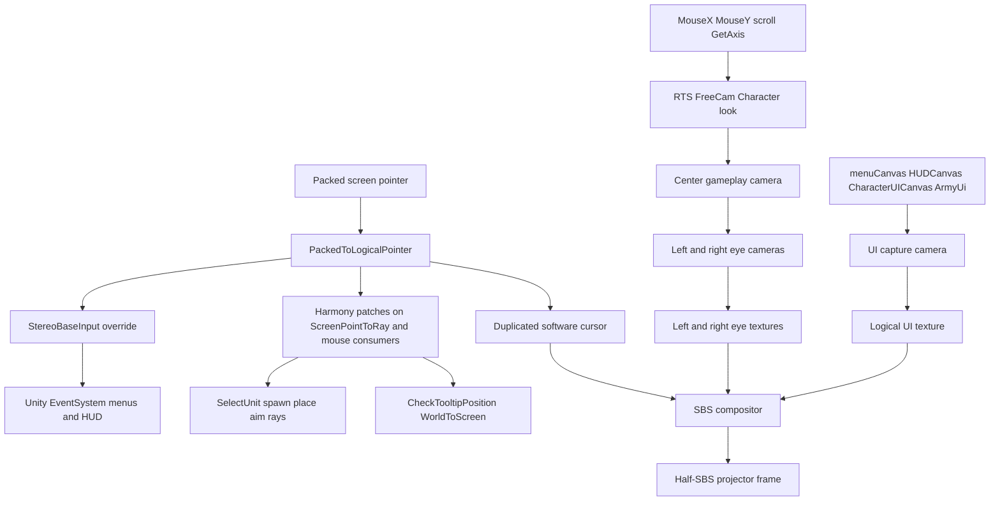
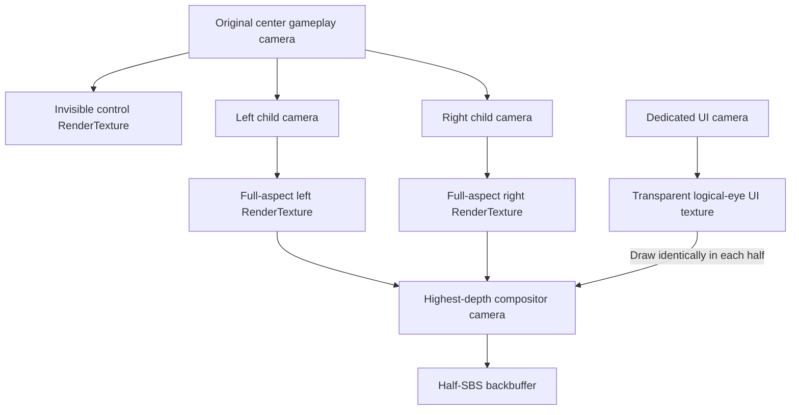

# UEBS2 Half-SBS Stereo

## Intent
The intent is not merely “add left/right cameras.” It is to make **the whole UEBS2 playable experience** work on a 3D projector in half-SBS:

- Correct fuseable world depth
- Every menu and submenu
- Battle HUD and army/possession UI
- Cursors, tooltips, hints, dialogs, popups
- Selection, placement, drag, spawn/build flows
- Camera modes and their controls
- Loading, fades, pause, settings, results, cinematics
- All the little accompanying details—known now or discovered later at runtime
- Full reversibility via F8 and uninstall

If something is visible, clickable, hoverable, or part of normal play in mono UEBS2, Phase 1 must make it correct under packed SBS unless it is explicitly deferred (full VR only). A named checklist is a starting inventory, not an upper bound.

## Tooling mandate — jcodemunch and jdocmunch
This project **requires** both MCP indexes. Agents working the mod must use them; Grep/Read/Glob are not the primary path for indexed material.

### jcodemunch (plugin / code)
- Index root: `c:\Users\samsa\Desktop\Workplace\Projects\UEBS2 Mods` (StereoMod C# and tools scripts).
- Repo display name target: `UEBS2 Mods` / `local/UEBS2 Mods`.
- After scaffold and after any meaningful code change: `index_folder` (incremental) or `register_edit` for touched symbols.
- Prefer: `list_repos` → `search_symbols` / `search_text` → `get_context_bundle` / `get_symbol_source` → `find_references` / `get_call_hierarchy` / `get_blast_radius` before editing.
- Use jcodemunch to locate Harmony patch targets in our plugin, UiCapture/StereoInput call sites, dual-mono state machine, and compositor wiring—do not rediscover by raw file walks once indexed.
- Closed game `Assembly-CSharp.dll` is not source-indexed here; runtime probe + string/reflection notes feed the inventory. Plugin implementation symbols live in jcodemunch.

### jdocmunch (plan / docs)
- Index root: workspace `docs/` plus root plan texts (`UEBS2_3D_VR_Mod_Plan.txt`, acceptance notes, `tools/build-sbs-bundle.md`, install/uninstall notes).
- Repo name: `uebs2-mods-docs`.
- Prefer: `doc_list_repos` → `search_sections` / `search_titles` / `lookup_term` → `get_section` / `get_section_context` when checking intent, wiring contract, acceptance, or delivery order.
- Keep docs in sync with the live plan: after plan revisions, reindex docs (`index_local` incremental) so acceptance/wiring text remains searchable.
- Before claiming a todo complete, confirm against jdocmunch acceptance/wiring sections rather than memory alone.

### Agent workflow gate
1. Call `jcodemunch_guide` / list repos at session start if indexes may be stale.
2. If `UEBS2 Mods` or `uebs2-mods-docs` is missing, index before feature work.
3. Plan/intent questions → jdocmunch. Code change questions → jcodemunch.
4. `AGENTS.md` is present at workspace root and states this mandate. Keep it updated if tooling paths change.
5. `docs/PLAN.md` must stay a synced copy of the live Cursor plan after each plan revision; then refresh `uebs2-mods-docs`.

## Bootstrap status (2026-07-23)
- Created: `AGENTS.md`, `docs/PLAN.md`, `docs/acceptance.md`, `tools/build-sbs-bundle.md`
- jdocmunch: `local/uebs2-mods-docs` indexed (5 docs; section count changes with reindex — do not treat a hard-coded section number as authoritative)
- `UEBS2_3D_VR_Mod_Plan.txt` is historical discovery notes only. See `docs/LEGACY.md`. Authoritative Phase 1 architecture/wiring/acceptance is `docs/PLAN.md` (synced from this Cursor plan). On conflict, ignore the `.txt`.
- Blocked while Plan mode refuses non-markdown edits: `StereoMod/*.cs` / `.csproj` stub and therefore jcodemunch `index_folder`
- Next agent-mode action: create StereoMod stub → `index_folder` → mark `index-tooling` completed → continue `establish-loader`

## Completeness principle
- **Catch-all rule:** any screen-space visual discovered by the runtime probe or during playtesting is automatically in scope for duplicated UI capture and packed→logical input, even if it was not named in this document.
- **No “good enough missing HUD”:** Phase 1 is incomplete while any normal-play overlay is split, missing, undraggable, or only works in one packed half.
- **No “unsupported” escape for normal play:** a surface that appears in normal UEBS2 play cannot be marked unsupported and left broken. It must be wired, rebuilt as uGUI under UiCapture, or proven never shown in normal play.
- **Discover → classify → wire → accept:** probe/catch-all finds the surface; classify as screen-space UI, world-space, IMGUI, or fullscreen effect; wire it; append to `AcceptanceLedger`.
- **Projector-safe present rule:** while `stereoEngaged`, never emit native full-frame mono. If world stereo cannot run, present **dual-mono SBS**. Only F8 and uninstall restore true mono.
- **Presenter invariant:** while `stereoEngaged`, a compositor/standby presenter must present every frame (live SBS, dual-mono, or last-good SBS). Never tear down the presenter before its replacement is ready.
- Temporary UI hide is allowed only as the first world-stereo proof. It is not an acceptable end state and must leave the F8 enable path once UiCapture exists.

## Delivery order
0. Index jcodemunch + jdocmunch; keep them current
1. Loader + RuntimeProbe report artifact
2. Fast world-stereo proof with temporary UI hide (proof-only enable path)
3. Install catch-all hooks + AcceptanceLedger
4. Exit proof UI hide; wire named UI + catch-all-classified canvases (visual)
5. Control wiring + either-half operability
6. Incidental backlog + non-temporal presentation overlays
7. Camera-mode rebinds + compatibility/performance
8. Clean-pass (sole Phase 1 exit gate)

“Mono HUD” means the same complete UI image is drawn into both packed eyes. It does **not** mean drawing one UI across the packed frame.

## Verified constraints
- Game: `C:\Program Files (x86)\Steam\steamapps\common\UEBS2\UEBS2.exe`
- Unity 2018.4.26f1, Mono, x64, D3D11
- BepInEx is not installed
- Do not modify `UEBS2.exe`, `Assembly-CSharp.dll`, `UnityPlayer.dll`, or `UEBS2_Data\boot.config`
- Real camera controllers to prefer: `HeroCamera`, `FreeCamera`, `ExampleCharacterCamera`, `FlyCamera`, plus modifiers `HS_CameraShaker` and `CameraOffsetManager` (`ExternalLateUpdate` / `CopyCameraOffset`)
- Do not treat string hits such as `CharacterCamera`, `ChildCamera`, `SpawnCamera`, `NearestCameraPositionForLOD`, or `PlayerCameraSettings` as controller types; they are methods or unrelated owners
- Rendering stack includes PPS v1 `PostProcessingBehaviour` in `Assembly-CSharp.dll`, `HorizonBasedAmbientOcclusion.HBAO` in `HBAO.Runtime.dll`, and custom producers `AllPost`, `UEBSTwoLighting`, `PostLightBg`, and `RFX1_LegacyRenderDistortion`
- Also present: `OnRenderImage`, `CommandBuffer`, `RenderTexture`, depth textures, world-space UI, EventSystem input, and screen-point ray construction

## Complete UI / menu / control inventory
These surfaces are confirmed present in `Assembly-CSharp.dll` and must be covered by the wiring contract. The runtime probe fills in exact active instances, but no surface class below is optional for Phase 1 completion.

### Menu and screen canvases
- Main / campaign / battle menus: `UIManager`, `InitializeMenuManager`, `mainMenu`, `menuCanvas`, `MainMenu`, `BattleMenu`, `CampaignMenu`, `ParentUnitMenu`, `ContextMenu`, `ExitToMenu` / `QuitToMenu`, `InMainMenu`, `currentMenuOpen` / `SetMenuOpen`
- Character / inventory / map / journal style menus: `ActivateMainMenu`, `ActivateInventoryMenu`, `ActivateMapMenu`, `ActivateJournalMenu`, `ActivateCraftingMenu`, `ActivateAlchemyMenu`, `ActivateStatsMenu`, `CharacterUICanvas`, `InventoryUIElements`, `CraftingUIElements`, `BlessingsUIElements`, `ItemUI`
- HUD and army UI: `HUDCanvas`, `ArmyUi`, `HandlePossessionUI`, `FrameratePanel`
- Input remapping UI: `CustomizeInputs`, `customInputScreen`, `customInputMenu`, `OpenCustomizeMenu`, `CloseCustomizeMenu`, `SaveAllInputs`, `LoadKeyboardInput`, `LoadControllerInput`

### Incidental and accompanying surfaces
These are part of the intent even when they are easy to overlook. Confirmed present in the game assembly and included in Phase 1 unless a playtest proves a surface never appears in normal play:

- Session flow: `Loading`, `Splash`, `Intro`, `Fade`, `Pause`, `Save`, `Confirm`, `Dialog`, `Popup`, `Results`, `Victory`, `Defeat`
- Settings / options: `Settings`, `Options`, `Graphics`, `Resolution`, and the customize-input screens already listed above
- Battle incidentals: `Selection`, `DragSelect`, `Placement`, `Preview`, `Ghost`, `Formation`, `Brush`, `Paint`, `Cooldown`, `Objective`, `Compass`, `Waypoint`, `Hint`, `Tooltip`, `Floating` combat/status text
- Presentation overlays: `Blood`, `Vignette`, `Flash`, `Logo`, `Overlay`, `Cinematic`
- Social / meta: `Chat`, `Workshop`, `Mod`, `Steam`, `Multiplayer`, `Error` / `Warning` dialogs, `WebGLCanvas` if present
- Any additional Overlay canvas, Screen Space Camera canvas, IMGUI drawer, fullscreen blit overlay, or absolute-pointer consumer discovered by the probe or during playtesting

### Classification for incidentals
- Screen-space UI / menus / HUD / dialogs / selection rectangles drawn as UI → UI capture RT, duplicated into both eyes, packed→logical pointer
- World-space markers / ghosts / placements → remain in eye renders with true depth
- Fullscreen image effects (`Vignette`, `Flash`, `Blood` as camera effects) → disabled for first proof only; before Phase 1 sign-off they must be applied per-eye on the eye RTs via `EffectsBridge`, reimplemented as duplicated UI overlays, or proven never shown in normal play. Leaving them disabled is not an acceptance outcome unless listed under Deferred (temporal-history only).
- IMGUI → while `stereoEngaged`, Harmony-prefix all game `OnGUI` methods to no-op so they cannot paint over the packed backbuffer after `OnRenderImage`. Probe classifies each owner as demo-only (no-op + ledger note) or normal-play (named uGUI rebuild under UiCapture owned by `ImguiCapture`). Vague “reproduce into the RT” is not a method.
- Unknown new surface → classify every frame before canvas submit via `Canvas.willRenderCanvases` while `stereoEngaged`; also use sceneLoaded / menu activation as accelerators. Do not rely on nonexistent `Canvas.OnEnable` managed hooks or a low-frequency scan as the only safety net.
- Classification must match the runtime render mode. Mislabeling screen-space as world-space/per-eye to skip duplication is a Phase 1 fail.

### Input systems that must keep working under stereo
- Menu: `AllMenuInputs`, `MenuInputNames`, `ResetMenuInputChecks`
- Global: `AllGlobalInputs`, `GlobalInputNames`, `ResetGlobalInputChecks`
- RTS / battle camera: `AllRTSCamInputs`, `RTSCameraInputNames`, `KeyboardRtsCamDefaults`, `ResetRTSCamInputChecks`, `SetRTSCam`
- Free camera: `AllFreeCamInputs`, `FreeCameraInputNames`, `CaptureInput`, `ReleaseInput`, `ResetFreeCamInputChecks`, `SetFreeCam`
- Character / possession: `AllCharacterInputs`, `CharacterInputNames`, `PlayerCharacterInputs`, `HandleCharacterInput`, `ResetCharacterInputChecks`
- Pointer axes used by those systems: `MouseXInput`, `MouseYInput`, `MouseScrollInput`, `lookInputVector`, `moveInputVector`, `GetAxis`
- Cursor ownership: `LockCursor`, `LockInput`, `SetCursorVisible`, `MouseInPanel`, `MouseOutPanel`
- World picking / placement: `SelectUnit`, `ScreenPointToRay`, `WorldToScreenPoint`, `ScreenToWorldPoint`, `RectTransformUtility`, `CheckTooltipPosition`, spawn/place/build flows
- Unity UI events: `EventSystem`, `PointerEventData`, `IPointerClick`, `pressEventCamera`, `BaseInput`
- IMGUI / legacy overlays: `OnGUI`, `RainGUI`, `RFX1_DemoGUI`, `showGUI`, `IMGUIModule`

### Plugin controls
- `F8`: enable/disable stereo
- `[` / `]`: adjust eye separation
- `;` / `'`: adjust convergence
- `F7`: swap eyes
- `F6`: zero-IPD diagnostic
- All plugin hotkeys must be ignored while the game’s custom-input capture screen is open (`customInputMatch` / `enableInputCapture`)

## Complete wiring contract



### Canonical coordinate mapper
One shared function owns all pointer conversion:

```text
PackedToLogicalPointer(packedX, packedY, packedW, packedH, latchedHalf?) -> (logicalX, logicalY, eyeHalf)
  halfW = packedW / 2
  eyeHalf = latchedHalf if set else (Left if packedX < halfW else Right)
  if eyeHalf == Left:
      logicalX = packedX * 2
  else:
      logicalX = (packedX - halfW) * 2
  logicalY = packedY
```

Rules:
- Either packed half maps to the same logical-eye UI and the same center-eye world ray for a **new** click.
- Latch only on pointer-down:
  ```text
  raw = original_mousePosition()
  if GetMouseButtonDown(i) for i in 0..2: latchedHalf = halfFrom(raw.x)
  if all mouse buttons up: latchedHalf = null
  return PackedToLogicalPointer(raw, latchedHalf)
  ```
  Never reassign `latchedHalf` from a non-down `mousePosition` get.
- Logical resolution equals the UI/eye RT size, not the packed half width.
- Scroll wheel, keyboard, and controller buttons are unchanged; only absolute pointer positions are remapped.
- Relative look axes (`MouseXInput`, `MouseYInput`, `GetAxis` mouse deltas) are **not** remapped; they drive the center camera normally.

### Single remap boundary
Absolute pointer remapping happens exactly once:
1. Harmony-patch `Input.get_mousePosition` as the sole packed→logical converter (read raw packed via original/bypass, then map).
2. `StereoBaseInput.mousePosition` returns `Input.mousePosition` unchanged (no second conversion).
3. `ScreenPointToRay` / `ScreenToWorldPoint` patches must **not** remap the point; they only force the center/control camera when the wrong camera would be used.
4. Helper patches (`MouseInPanel`, `MouseInRect`, cached `lastMouse`, etc.) remap only if they read coordinates from a source other than `Input.mousePosition`.

### Visual wiring for every UI surface
1. Do not start UiCapture remap until the RuntimeProbe canvas classification artifact exists.
2. Snapshot and convert all Overlay / Screen Space Camera canvases—including `menuCanvas`, `HUDCanvas`, `CharacterUICanvas`, `WebGLCanvas`, army/possession UI, tooltips, and customize-input screens—to Screen Space Camera on the dedicated UI camera.
3. Mandatory `UiCapture` assignments for every converted canvas: `canvas.worldCamera = uiCamera`, GraphicRaycaster uses that camera, preserve `sortingOrder`, `planeDistance`, and `CanvasScaler`, and keep nested-canvas order.
4. Reserve one unused layer for UI capture; eye cameras exclude it; world-space canvases stay in world space. If no free layer exists, steal a currently unused or lowest-impact user layer with full snapshot/restore, or isolate remapped canvases solely through the UI camera’s culling mask. Layer exhaustion after those fallbacks is a hard Phase 1 fail—never ship world stereo with UI wiring blocked.
5. UI camera clear flags are `SolidColor` with alpha 0 into a transparent logical-eye UI RT.
6. Render the UI camera once to that RT each frame, then composite the same UI texture into both packed halves.
7. Hide the hardware cursor while stereo is on; draw one software cursor into the UI RT so both eyes see the same cursor. Re-assert `Cursor.visible = false` late each frame after game cursor writes; restore snapshots only on stereo disable.
8. While `stereoEngaged`, Harmony-prefix all game `OnGUI` methods to no-op. Demo-only IMGUI stays no-op with a ledger note; normal-play IMGUI gets a named uGUI rebuild under `ImguiCapture`.
9. Every frame while `stereoEngaged`, on `Canvas.willRenderCanvases`, classify/convert/hide any new Overlay/SSC **before** canvas submit so native Overlay cannot stamp full-frame mono over the compositor. Use sceneLoaded / `SetMenuOpen` as accelerators; append each new surface to `AcceptanceLedger`.
10. `ExitProofUiHide()` runs only after catch-alls are live. It restores proof-changed visibility (`enabled` / `activeSelf`) and cursor fields only — never `renderMode`, `worldCamera`, `planeDistance`, or scaler. Steady-state `EnableStereo()` must not call proof hide once UiCapture exists.
11. Visual identity (identical in both halves) is the § UI acceptance bar. Either-half click/raycast operability is verified in control wiring, not here.

### Control wiring by mode

| Mode | Visual path | Pointer path | Look/move path | Stereo policy |
|---|---|---|---|---|
| Main / campaign / battle menus | Captured UI duplicated into both eyes | `StereoBaseInput` + latched packed→logical | Menu navigation keys/controller unchanged | World stereo if a valid source exists; otherwise dual-mono SBS (identical image in both halves). Never native mono while stereo mode is engaged |
| Customize-input screen | Captured UI duplicated | Packed→logical for widget hits; ignore plugin hotkeys while capturing | Unchanged | Dual-mono or world stereo as above; never steal rebound keys |
| Battle HUD / army / possession UI | Captured UI duplicated | Packed→logical EventSystem | Unchanged | Stereo on |
| Tooltips / panels (`CheckTooltipPosition`, `MouseInPanel`) | Captured UI or remapped screen position | Packed→logical, then existing tooltip logic | Unchanged | Stereo on |
| RTS select / spawn / place / build | World remains stereoscopic | Remapped absolute mouse + center-camera rays | RTS camera inputs unchanged | Stereo on |
| Free camera | World stereoscopic from free cam | If cursor unlocked for UI, packed→logical; if captured for look, deltas unchanged | `AllFreeCamInputs` unchanged; `CaptureInput`/`ReleaseInput` preserved | Stereo on after free-cam source rebind |
| First / third person / hero | World stereoscopic from hero/example cam | Aim/select rays use center camera + logical coords | `AllCharacterInputs` unchanged | Stereo on after source rebind |
| Fly camera | World stereoscopic | Same as free/hero depending on cursor state | Fly inputs unchanged | Stereo on after source rebind |
| Unsupported cinematic / spawn cam takeover | Dual-mono SBS (identical center/UI in both halves) | Keep packed→logical UI path active | Unchanged | Stay in projector-safe SBS; only F8 restores true mono |

### Exact Harmony / EventSystem wiring points
- Install `StereoBaseInput` on the active `BaseInputModule` through `inputOverride` while stereo is on; restore previous override on disable. Its `mousePosition` returns `Input.mousePosition` with **no** second remap.
- While stereo is on, Harmony-patch `Input.get_mousePosition` as the sole packed→logical converter. Read raw packed via original/bypass; update latch only on mouse-button-down; clear latch when all buttons are up; return `PackedToLogicalPointer(...)`.
- `ScreenPointToRay` / `ScreenToWorldPoint` patches force the center/control camera when needed and must not remap already-logical points.
- Probe-listed helpers that read absolute coords from non-`Input.mousePosition` sources (`MouseInPanel`, `MouseOutPanel`, `MouseInRect`, `RelativeMousePosInRect`, cached `lastMouse` / `mousestart`) get targeted patches. Helpers that already go through `Input.mousePosition` are covered by the catch-all.
- Do not mark control wiring done until (a) the `get_mousePosition` catch-all is installed and (b) every probe-listed absolute-pointer helper is patched or proven delta-only.
- Do not alter keyboard/controller button bindings.

### Plugin module wiring
```text
Plugin
  ├─ RuntimeProbe           report artifact: cameras, canvases, OnGUI, pointer sites, cursors
  ├─ AcceptanceLedger       append probe/catch-all surfaces; clean-pass reads this
  ├─ StateSnapshot          transactional save/restore for every mutated object
  ├─ StereoRig              center redirect, eye cams, presenter invariant
  ├─ CameraSourceBinder     source select/rebind, EnterDualMonoSbs triggers, fallback mono cam
  ├─ StereoProjection       off-axis matrices, eye swap, IPD/convergence clamps
  ├─ EffectsBridge          deny-list, snapshot, per-eye whitelist, temporal leave-disabled
  ├─ UiCapture              canvas remap, UI layer, UI RT, software cursor, willRenderCanvases
  ├─ ImguiCapture           OnGUI no-op prefixes + named uGUI rebuilds for normal-play IMGUI
  ├─ StereoInput            PackedToLogicalPointer, get_mousePosition catch-all, StereoBaseInput,
  │                         helper patches, hotkey gate (StereoHotkeys)
  └─ StereoCompositor       ordered Render() of eyes+UI, AssetBundle shader, dual-mono pack
```

Enable path: set `stereoEngaged` → ensure presenter ready → snapshot → create RTs/cameras/material → suppress source present → enable eyes/UI capture → install input override/patches → show software cursor.  
`EnterDualMonoSbs()` path: while `stereoEngaged` remains true, use for lost source, orthographic/invalid projection, cinematic takeover, scene unload/rebind gaps, and recoverable exceptions—never native mono. If no bindable gameplay source exists, use a plugin **fallback mono camera** (clear color / last frame) → one full-aspect RT packed into both halves + UI RT.  
`DisableStereoAndRestore()` path: only F8, plugin destroy/uninstall, or unrecoverable failure that clears `stereoEngaged`—uninstall patches/override → restore canvases/cursor/effects/cameras → destroy plugin objects → clear snapshots → emit true mono.  
All three paths are idempotent. While `stereoEngaged`, the presenter never goes dark between teardown and rebind.

## Chosen rendering architecture
Raw half-width camera viewports are rejected because they alter the effective projection aspect and interfere with screen-space effects.



### Center/control camera
- Keep the original gameplay camera object and all controller/shake components intact.
- Keep its `MainCamera` tag and center-eye transform so `Camera.main`, camera-relative movement, and center-eye ray logic continue to reference the game-owned object.
- Before changing it, snapshot all render settings used by the eye cameras. While stereo is active, route the original camera to an invisible control RenderTexture whose dimensions equal the logical-eye resolution, keep `rect = (0,0,1,1)`, set its live culling mask to zero, and disable its image-effect components. This keeps the Camera component enabled without writing to the backbuffer and gives center-camera ray projection a defined coordinate space.
- Restore every changed field only when `DisableStereoAndRestore()` runs (F8 / uninstall / unrecoverable clear of `stereoEngaged`). Scene changes and recoverable failures while `stereoEngaged` stay on the dual-mono / rebind path instead of restoring native mono.

### Eye cameras
- Create new child GameObjects containing only a `Camera`; do not clone the gameplay GameObject, controller scripts, `AudioListener`, effects, or tags.
- Parent the eyes to the **actual rendering `Camera` transform**, not a controller root such as `HeroCamera` when `HeroCamera.cam` is a child. Keep eye local scale `(1,1,1)`.
- If the parent hierarchy has non-unit scale, set eye world positions each frame as `headPosition ± head.right * (EyeSeparationWorldUnits / 2)` instead of relying on local X offsets alone.
- Copy settings from the preserved source snapshot, then refresh only source fields that remain valid while redirected. Never copy the live zero culling mask. Mirror vertical FOV, near/far planes, original culling mask, clear flags, rendering path, depth texture mode, HDR, MSAA, and occlusion culling.
- After `Camera.CopyFrom`, always re-apply eye overrides last: `stereoTargetEye = None`, target RT, full rect, eye aspect, depth, untagged, no listener, and the asymmetric projection matrix.
- Render each eye to an independent full logical-eye aspect RenderTexture. For half-SBS, each eye is rendered at 16:9 and then horizontally packed into one 16:9 output frame.
- Set both eye tags to `Untagged` and ensure neither eye has an `AudioListener`.

### Projection
- Use parallel camera axes. Do not toe-in or yaw the eyes.
- For eye offset `e` from head center, near `n`, far `f`, convergence `C`, vertical half-height `t = n * tan(vFovRad/2)`, and half-width `w = t * logicalEyeAspect`:
  - `shift = -e * n / C`
  - `Matrix4x4.Frustum(-w + shift, w + shift, -t, t, n, f)`
- Never assign a GPU-converted matrix from `GL.GetGPUProjectionMatrix` to `Camera.projectionMatrix`.
- Include an eye-swap control because projector left/right conventions vary.
- Require `n > 0`, `f > n`, `C > n`, finite aspect, and finite IPD; on invalid source data while stereo mode is engaged, enter dual-mono SBS instead of native mono.
- Reset custom matrices before destroying cameras.
- Phase 1 supports perspective gameplay cameras. If the selected source is orthographic or already uses an unsupported custom projection, switch to dual-mono SBS with one diagnostic log entry; do not emit native mono while stereo mode is engaged.
- Start with `EyeSeparationWorldUnits = 0.064` and convergence `10.0`, then tune live. Include zero-IPD as a diagnostic.

### RenderTextures and compositor
- Default to half-SBS only for Phase 1.
- Derive packed output size from the live backbuffer (`Screen.width` × `Screen.height`). Allocate each eye RT and the UI RT at logical-eye size `packedW × packedH × ResolutionScale` (same aspect as the full frame, not the half width). Recreate after a debounced screen-size / fullscreen change from those live values—not a hard-coded 1920×1080 default.
- Match source HDR/color behavior (`DefaultHDR` for HDR, otherwise `Default`) and preserve sRGB/gamma behavior.
- Use 24-bit depth. Normalize MSAA to `1`, `2`, `4`, or `8`, cap it to the source/quality setting, check platform support, and retry texture creation with MSAA `1` if allocation fails.
- Create a compositor camera whose depth is recalculated above every screen-target camera. It clears the output black and composites packed halves in `OnRenderImage`.
- Keep both eye cameras and the UI camera disabled for Unity’s automatic camera loop. In the compositor camera’s `OnPreCull`, call `Render()` for left eye, right eye, and UI camera in that exact order; then composite those freshly rendered textures in `OnRenderImage`. This removes target-dependent depth-order ambiguity and prevents one-frame UI/cursor lag.
- When dual-mono SBS is required, do **not** composite the zero-cull control RT. Render one full-aspect center-pose mono eye (snapshot culling mask restored on that mono eye camera, IPD 0 / single mono RT) and pack that same image into both halves with the duplicated UI texture. If no bindable gameplay source exists, use the plugin fallback mono camera instead.
- Ship a prebuilt Unity **2018.4.x** (prefer 2018.4.26f1) AssetBundle containing the compositor material/shader that samples `_LeftTex`, `_RightTex`, and `_UiTex`, remaps each packed half to full eye UVs, and applies identical UI UVs to both halves. Document the bundle build in `tools/build-sbs-bundle.md`. Load via `AssetBundle.LoadFromFile`. If the bundle/material is missing, refuse to set `stereoEngaged` and log once—do not imply runtime compile from `.shader` text in the player.
- Handle D3D11 RenderTexture UV orientation and gamma/sRGB explicitly; verify with an orientation test pattern.
- Restore `RenderTexture.active` and GL state after compositing. The game already logs RT-active release warnings, so leaky state here can black-frame the result.
- The compositor overwrites the complete backbuffer, preventing lower-depth child, spawn, or cinematic cameras from leaking into the packed image. While `stereoEngaged`, never disable this presenter before a replacement presenter is ready.

## First visible SBS proof
- On F8 enable for this proof only, temporarily hide screen-space canvases and the hardware cursor after snapshotting their state.
- Keep world-space canvases in the eye renders.
- This proof exists only to validate fuseable world stereo quickly. Its enable path must not remain the shipped F8 path after catch-alls / UiCapture exist.
- Required exit order (do not reverse):
  1. While proof hide is still active, install catch-alls (`willRenderCanvases`, `get_mousePosition`, OnGUI no-ops, `AcceptanceLedger`).
  2. Then `ExitProofUiHide()` restores **only** proof-changed visibility (`enabled` / `activeSelf`) and cursor fields — never `renderMode`, `worldCamera`, `planeDistance`, or scaler (those belong to UiCapture).
  3. Then named inventory / catch-all-classified UiCapture wiring.
- Leaving proof hide or the first-proof effect deny-list as the steady enable path is a Phase 1 fail.
- Acceptance for this proof only: battle visible in two correctly oriented halves, zero-IPD halves match, nonzero IPD has horizontal parallax, F8 restores mono.

## Effects and secondary systems
- Owned by `EffectsBridge`. First proof disables known source image producers on the selected battle camera and does not copy them to eye cameras. Default deny list: `PostProcessingBehaviour`, `HBAO`, `AllPost`, `UEBSTwoLighting`, `PostLightBg`, and `RFX1_LegacyRenderDistortion`, plus any additional `OnRenderImage` components found on that camera hierarchy.
- Snapshot each component’s original enabled state and restore it on `DisableStereoAndRestore`.
- After proof, whitelist non-temporal effects one at a time on each full-aspect eye RT before clean-pass. Effects with shared temporal history remain disabled only if listed under Deferred.
- Copy required camera CommandBuffers to both eyes only after confirming they do not share writable per-camera state; otherwise disable them during stereo.
- Keep exactly one original `AudioListener` on the center camera object; never add listeners to eye cameras.
- Compatibility pass may use `LODSwitcher.SetCustomCamera` with a mid-eye proxy if LOD shimmer is visible; otherwise document it.
- Test shadow cascades, soft particles, billboards, planar reflections, and transparent sorting as compatibility defects; they do not block the initial UI-hidden stereo proof unless the image is unfusable.

## Camera lifecycle
- Select the source from enabled, screen-target gameplay cameras with known controller components; exclude all plugin-created cameras.
- Retain the currently bound source by instance ID while stereo is active; do not reject it merely because the plugin redirected it to the control RenderTexture.
- In `LateUpdate`, use `Camera.GetAllCameras` with a reused buffer to detect screen-target camera-stack changes without steady-state allocations. Re-evaluate before rendering when a camera is added, removed, enabled, disabled, retargeted, or changes priority—even if the old source remains enabled.
- Re-evaluate after scene loads and whenever the source becomes disabled or destroyed.
- Bind battle cameras first. During an unsupported spawn/cinematic transition, switch to dual-mono SBS instead of native mono, and keep UI/input wiring active.
- Add explicit support for free, first-person, third-person, fly, and hero modes after the basic battle camera succeeds.

## Safety and rollback
- Target `netstandard2.0`; reference BepInEx and Unity assemblies with `Private=false` so game assemblies are not copied into the plugin output.
- Install the latest official stable BepInEx 5 Windows x64 release available at execution time.
- Extract the BepInEx archive to a temporary directory first and compare every destination path against the game root. Abort on any file or directory collision instead of overwriting pre-existing content. After collision-free installation, record extracted paths and the post-first-launch delta, including generated configuration, cache, patcher, plugin, and log paths. Uninstall removes only manifest-owned paths.
- Store runtime snapshots with retained Unity object references, instance IDs, and scene handles; do not rely on reusable instance IDs alone.
- Snapshot and restore both `Cursor.visible` and `Cursor.lockState`. While stereo is on, re-assert hardware cursor hidden late each frame after game cursor writes.
- Maintain an explicit `stereoEngaged` flag. `DisableStereoAndRestore()` runs only for F8, plugin destroy/uninstall, and unrecoverable failure that clears `stereoEngaged`.
- While `stereoEngaged` remains true, lost source / orthographic source / cinematic takeover / invalid projection / recoverable render errors call `EnterDualMonoSbs()` only—never native mono.
- Scene unload/load while `stereoEngaged`: tear down and rebind; stay in dual-mono SBS until a valid source exists, then return to world stereo. Do not emit native mono across the transition.
- If a render/setup exception occurs, log it once, enter dual-mono or full restore according to whether `stereoEngaged` stays set, and never leave a half-mutated camera/UI state.

## Workspace layout
```text
UEBS2 Mods/
  AGENTS.md                 # mandates jcodemunch + jdocmunch
  UEBS2_3D_VR_Mod_Plan.txt
  docs/
    PLAN.md                 # synced working copy of the live stereo plan
    acceptance.md           # ledger-facing acceptance notes
    probe/                  # RuntimeProbe report artifacts
  StereoMod/
    UEBS2Stereo.csproj
    Plugin.cs
    RuntimeProbe.cs
    AcceptanceLedger.cs
    StateSnapshot.cs
    StereoRig.cs
    CameraSourceBinder.cs
    StereoProjection.cs
    StereoCompositor.cs
    EffectsBridge.cs
    UiCapture.cs
    ImguiCapture.cs
    StereoInput.cs
    StereoHotkeys.cs
    Bundles/
      sbs_composite
  tools/
    install-bepinex.ps1
    deploy-plugin.ps1
    uninstall.ps1
    build-sbs-bundle.md
```

## Execution sequence

### 0. Indexes
- `index_folder` on the UEBS2 Mods workspace for jcodemunch (refresh after StereoMod scaffold).
- `index_local` name `uebs2-mods-docs` on workspace docs + plan texts for jdocmunch.
- Write `AGENTS.md` with the tooling mandate.
- Subsequent sessions: `list_repos` / `doc_list_repos` first; reindex when stale.

### 1. Loader and RuntimeProbe artifact
- Build the minimal plugin, install BepInEx, and confirm `BepInEx/LogOutput.log`.
- Write the RuntimeProbe report: canvases+renderMode, OnGUI owners (demo vs normal-play), absolute-pointer call sites, cursor owners, battle/source camera transform, effects/CommandBuffers, resolution/color space.
- Confirm projector half-SBS packing and left/right order.
- Do not start UiCapture or Harmony wiring without this artifact.
- After StereoMod source exists: reindex jcodemunch and confirm `search_symbols` finds `PluginInfo` / session types.

### 2. Fast UI-hidden SBS vertical slice (proof-only)
- Implement center-camera preservation, child eye cameras, off-axis projection, eye RTs, AssetBundle compositor, presenter invariant, F8 restoration, eye swap, IPD, convergence, zero-IPD diagnostics, and dual-mono/fallback mono camera.
- Launch a small battle and obtain the first half-SBS image with screen-space UI hidden.
- Fix only blockers to stable, fuseable world stereo. Do not leave this proof hide on the shipped enable path.

### 3. Install catch-alls
- Install `Canvas.willRenderCanvases` classify/convert/hide, `Input.get_mousePosition` packed→logical catch-all with down-only latch, OnGUI no-op prefixes, and `AcceptanceLedger`.
- Log every unclassified surface into the ledger before any “complete” wiring todo.

### 4. UI visual wiring
- `ExitProofUiHide()`; UiCapture becomes mandatory whenever `stereoEngaged`.
- Capture named inventory canvases plus any catch-all-classified Overlay/SSC; software cursor; visual identity in both halves.
- Exit first-proof deny-list for non-temporal producers via `EffectsBridge` as soon as visual path is stable, or schedule explicit per-eye restore in §6—do not leave proof disables past clean-pass.
- §4 accepts visual identity only, not either-half clicks.

### 5. Control wiring
- Confirm catch-all mouse remap is live; `StereoBaseInput` does not double-remap.
- Patch probe-listed non-`Input.mousePosition` helpers; force center cam on ray helpers without remapping points.
- Verify the same control is operable from either packed half; seam-continuous drag; unlocked UI vs locked look; hotkey gate during custom-input capture.
- Bind free / hero / example / fly sources after battle camera; dual-mono only for unsupported cinematic/ortho.

### 6. Incidental backlog
- Close residual ledger items and inventoried session/battle incidentals (loading/fade/pause/settings/results/selection/placement/hints/objectives/compass/chat/workshop/mod/`WebGLCanvas`).
- Named uGUI rebuilds for normal-play IMGUI via `ImguiCapture`.
- Restore non-temporal presentation overlays per-eye or as duplicated UI; temporal-history effects may stay disabled only if listed under Deferred.

### 7. Compatibility and performance
- Rebind across supported camera changes; dual-mono during unsupported gaps; presenter never goes native mono.
- Test resize/fullscreen, scene transitions, pause, focus loss, audio, shadows/LOD/particles as needed.
- Measure frame time; tune resolution scale; retain F8 escape.

### 8. Clean-pass
- Sole Phase 1 exit gate. Every AcceptanceLedger item closed or explicitly Deferred. Compatibility defects closed or Deferred.

## Acceptance matrix
- Loader (§1): game starts normally with plugin present and starts normally after manifest uninstall.
- Mono restoration (§2/F8): enable/disable repeatedly without stale state. Only F8/uninstall emit true native mono.
- Geometry (§2): zero-IPD halves match; eye swap works; nonzero IPD has horizontal disparity without toe-in vertical disparity.
- Composition (§2): halves upright, ordered, seam-free, correct aspect at live backbuffer resolution including after resize; AssetBundle compositor present or stereo refuse-to-engage.
- Catch-alls (§3): willRenderCanvases, get_mousePosition, OnGUI prefixes, and AcceptanceLedger are live before UI completeness claims.
- Menus visual (§4): main, campaign, battle, customize-input, inventory/map/journal-style, context/unit menus identical in both halves.
- Menus operable (§5): same menus clickable/draggable from either packed half.
- HUD visual (§4) / operable (§5): battle HUD, army UI, possession UI, tooltips, hints, panels.
- Incidentals (§6): loading/splash/fade, pause/confirm/dialog/popup, settings/graphics, results/victory/defeat, selection/drag/placement/preview/ghost, objectives/compass/waypoints, chat/workshop/mod/`WebGLCanvas`, and ledger discoveries — matching real render mode; non-temporal overlays not left disabled.
- Cursor (§4–5): hardware cursor stays hidden; software cursor duplicated; lock/unlock and free-cam capture/release restore.
- IMGUI (§3/§6): no game `OnGUI` paints over the pack; normal-play IMGUI has named uGUI rebuilds; demo-only noted in ledger.
- Pointer (§5): either-half clicks; seam-continuous drag via down-only latch; single remap boundary (no double remap).
- Gameplay controls (§5): select/spawn/place/build/tooltip/panel/drag-select use center-eye logical coords.
- Camera controls (§5–7): RTS/free/first/third/fly look/move work; relative look not double-scaled.
- Cameras (§5–7): supported modes stereo; unsupported gaps dual-mono SBS with presenter invariant; fallback mono cam when no source.
- Audio: exactly one listener remains active.
- Lifecycle: menu/battle/restart/scene/resize/focus/shutdown safe; no native-mono frames while `stereoEngaged`.
- Completeness (§8 clean-pass only): normal-play session reveals no unwired split/missing overlay; ledger empty or Deferred.
- Performance (§7): no steady-loop allocations; no log spam; small-battle stereo stable on projector.

## Phase 1 completion
Phase 1 is complete only when the **complete playable projector experience** works: fuseable half-SBS world stereo, all menus/HUD/tooltips/cursors, all control paths, and all accompanying incidental details discovered in normal play—without split overlays, broken picking, native-mono leakage onto the projector, or unrestorable state. F8 and manifest uninstall must restore the pre-mod installation.

## Deferred until Phase 1 is clean
- Full-SBS output
- OpenXR/SteamVR, head tracking, VR controllers
- Stereoscopic HUD depth
- Temporal post-processing that requires per-eye history management
- Giant-battle performance targets
